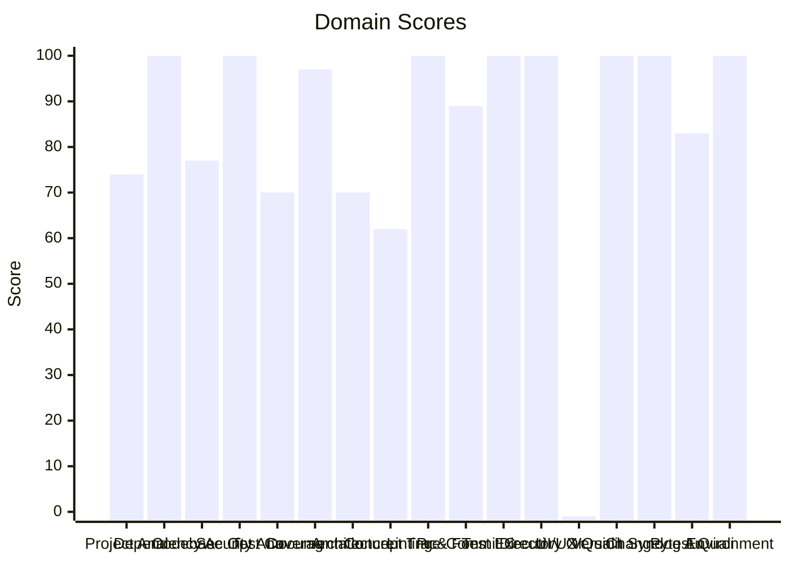

# 🔬 Code Enhancement Report

> **Generated**: 2026-05-22 22:28:34 UTC | **Target**: owncast-agent | **Overall GPA**: 3.0/4.0

---

## 📊 Executive Summary

| Domain | Grade | Score | Status |
|--------|-------|-------|--------|
| UI/UX Quality | ⚪ N/A | -1/100 | `░░░░░░░░░░░░░░░░░░░░░` -1/100 |
| Concept Traceability | 🟠 D | 62/100 | `████████████░░░░░░░░` 62/100 |
| Test Coverage | 🟡 C | 70/100 | `██████████████░░░░░░` 70/100 |
| Architecture & Design Patterns | 🟡 C | 70/100 | `██████████████░░░░░░` 70/100 |
| Project Analysis | 🟡 C | 74/100 | `██████████████░░░░░░` 74/100 |
| Codebase Optimization | 🟡 C | 77/100 | `███████████████░░░░░` 77/100 |
| Pytest Quality | 🔵 B | 83/100 | `████████████████░░░░` 83/100 |
| Pre-Commit Compliance | 🔵 B | 89/100 | `█████████████████░░░` 89/100 |
| Documentation & Governance | 🟢 A | 97/100 | `███████████████████░` 97/100 |
| Dependency Audit | 🟢 A | 100/100 | `████████████████████` 100/100 |
| Security Analysis | 🟢 A | 100/100 | `████████████████████` 100/100 |
| Linting & Formatting | 🟢 A | 100/100 | `████████████████████` 100/100 |
| Test Execution | 🟢 A | 100/100 | `████████████████████` 100/100 |
| Directory Organization | 🟢 A | 100/100 | `████████████████████` 100/100 |
| Version Sync Analysis | 🟢 A | 100/100 | `████████████████████` 100/100 |
| Changelog Audit | 🟢 A | 100/100 | `████████████████████` 100/100 |
| Environment Variables | 🟢 A | 100/100 | `████████████████████` 100/100 |

---

## 📋 Domain Scorecards

### Project Analysis — 🟡 Grade: C (74/100)

`██████████████░░░░░░` 74/100

> [!NOTE]
> Detected ecosystem marker: agent-utilities → Agent-Utilities Ecosystem

| Criterion | Points | Evidence | Reasoning |
|-----------|--------|----------|-----------|
| has_pyproject | 10 | `pyproject.toml and requirements.txt` | Both pyproject.toml and requirements.txt exist, fulfilling mandatory Python proj |
| project_type_detected | 10 | `Agent-Utilities Ecosystem` | Identified 1 ecosystem marker(s) in dependencies |
| externalized_prompts | 0 | `${WORKSPACE_ROOT}/agent-packages/agents/owncast-agent` | No prompts/ directory found. Prompts may be hardcoded in source. |
| observability | 0 | `dependency list` | No observability tools (logfire, sentry, opentelemetry) found |
| testing_suite | 10 | `tests dir: True, pytest dep: True` | Tests directory exists, pytest in dependencies |
| agents_md | 10 | `${WORKSPACE_ROOT}/agent-packages/agents/owncast-agent/AGE` | AGENTS.md exists with comprehensive content |
| pre_commit_hooks | 10 | `${WORKSPACE_ROOT}/agent-packages/agents/owncast-agent/.pr` | Pre-commit configuration found for automated code quality checks |
| gitignore | 10 | `${WORKSPACE_ROOT}/agent-packages/agents/owncast-agent/.gi` | .gitignore exists to prevent committing build artifacts and secrets |
| env_template | 10 | `${WORKSPACE_ROOT}/agent-packages/agents/owncast-agent/.en` | Environment template exists for onboarding and secret management |
| protocol_support | 4 | `MCP` | 1 communication protocol(s) detected |

**Findings:**
- Protocol support: MCP

---

### Dependency Audit — 🟢 Grade: A (100/100)

`████████████████████` 100/100

| Criterion | Points | Evidence | Reasoning |
|-----------|--------|----------|-----------|
| dependency_freshness | 100 | `source=${WORKSPACE_ROOT}/agent-packages/agents/owncast-ag` | Audited 5 deps (5 installed, 0 constraint-only). 0 major, 0 minor, 0 patch updat |

---

### Codebase Optimization — 🟡 Grade: C (77/100)

`███████████████░░░░░` 77/100

> [!NOTE]
> 1 functions exceed 200 lines (actionable refactoring targets): test_mcp_tools_routing (210L)

| Criterion | Points | Evidence | Reasoning |
|-----------|--------|----------|-----------|
| code_quality | 77 | `{"file_count": 25, "total_lines": 2910, "function_count": 18` | Analyzed 25 files, 183 functions. Avg CC=2.3, max length=210, duplication=1.2%,  |

**Findings:**
- 6 functions with nesting depth >4

---

### Security Analysis — 🟢 Grade: A (100/100)

`████████████████████` 100/100

| Criterion | Points | Evidence | Reasoning |
|-----------|--------|----------|-----------|
| security_posture | 100 | `high=0 med=0 low=0 attack_surface={"subprocess_calls": 0, "f` | Scanned 25 files. Found 0 security findings. High: -0pts, Med: -0pts, Low: -0pts |

---

### Test Coverage — 🟡 Grade: C (70/100)

`██████████████░░░░░░` 70/100

> [!NOTE]
> Test suite lacks intent diversity (only one type)

| Criterion | Points | Evidence | Reasoning |
|-----------|--------|----------|-----------|
| test_coverage_quality | 70 | `{"test_file_count": 7, "test_count": 23, "source_file_count"` | 23 tests across 7 files. Ratio: 0.92. Intent: {'unit': 23}. 1 without assertions |

**Findings:**
- 14 potential doc-test drift items

---

### Documentation & Governance — 🟢 Grade: A (97/100)

`███████████████████░` 97/100

> [!TIP]
> README.md missing sections: usage|quick start

| Criterion | Points | Evidence | Reasoning |
|-----------|--------|----------|-----------|
| documentation_quality | 97 | `{"README.md": {"exists": true, "missing": ["usage|quick star` | Audited 6 standard docs + docs/ directory. 0 broken references, 5 docs present.  |

**Findings:**
- 2 broken internal links in README.md
- README missing: Has a Table of Contents
- README missing: Has usage examples with code blocks

---

### Architecture & Design Patterns — 🟡 Grade: C (70/100)

`██████████████░░░░░░` 70/100

> [!NOTE]
> SRP: 3 classes have >15 methods

| Criterion | Points | Evidence | Reasoning |
|-----------|--------|----------|-----------|
| architecture_quality | 70 | `{"layers": 0, "di_ratio": 0.07, "solid_violations": 1}` | Analyzed 25 files. 0/5 architecture layers present, DI ratio: 7%, 1 SOLID violat |

**Findings:**
- No discernible layer architecture (no domain/service/adapter separation)
- Low dependency injection ratio: 7%

---

### Concept Traceability — 🟠 Grade: D (62/100)

`████████████░░░░░░░░` 62/100

> [!WARNING]
> Low traceability ratio: 17% concepts fully traced

| Criterion | Points | Evidence | Reasoning |
|-----------|--------|----------|-----------|
| concept_traceability | 62 | `{"total_concepts": 6, "well_traced": 1, "orphans": 3, "drift` | 6 unique concepts found. 1 fully traced (code+docs+tests), 3 orphans, 2 drifted. |

---

### Linting & Formatting — 🟢 Grade: A (100/100)

`████████████████████` 100/100

> [!TIP]
> Total lint findings: 0 (high/error: 0, medium/warning: 0, low: 0)

| Criterion | Points | Evidence | Reasoning |
|-----------|--------|----------|-----------|
| lint_compliance | 100 | `ruff=0, bandit=0, mypy=0` | 0 total findings across 3 tools. High/error: -0pts, Med/warning: -0pts, Low: -0p |

---

### Pre-Commit Compliance — 🔵 Grade: B (89/100)

`█████████████████░░░` 89/100

> [!NOTE]
> 1/27 pre-commit hooks failed: don't commit to branch

| Criterion | Points | Evidence | Reasoning |
|-----------|--------|----------|-----------|
| precommit_compliance | 89 | `{"total_hooks": 27, "passed": 25, "failed": 1, "skipped": 1,` | Ran pre-commit with 27 hooks: 25 passed, 1 failed, 1 skipped. 2 potentially outd |

**Findings:**
- 2 hook(s) may be outdated: ruff-pre-commit, uv-pre-commit
- Pytest hooks skipped (handled by CE-016 Test Execution): pytest, local-pytest

---

### Test Execution — 🟢 Grade: A (100/100)

`████████████████████` 100/100

| Criterion | Points | Evidence | Reasoning |
|-----------|--------|----------|-----------|
| test_execution | 100 | `{"frameworks_detected": 1, "total_passed": 23, "total_failed` | Executed 1 framework(s). 23 passed, 0 failed, 0 errors. Pass rate: 100%. |

---

### Directory Organization — 🟢 Grade: A (100/100)

`████████████████████` 100/100

| Criterion | Points | Evidence | Reasoning |
|-----------|--------|----------|-----------|
| directory_organization | 100 | `{"total_source_files": 65, "total_directories": 15, "max_dep` | 65 files across 15 directories. Max depth: 3, avg files/dir: 4.3. 0 crowded, 0 s |

---

### UI/UX Quality — ⚪ Grade: N/A (-1/100)

`░░░░░░░░░░░░░░░░░░░░░` -1/100

> [!TIP]
> No UI detected — domain not applicable

| Criterion | Points | Evidence | Reasoning |
|-----------|--------|----------|-----------|
| ui_detection | -1 | `${WORKSPACE_ROOT}/agent-packages/agents/owncast-agent` | No web or terminal UI framework detected. Domain skipped. |

---

### Version Sync Analysis — 🟢 Grade: A (100/100)

`████████████████████` 100/100

> [!TIP]
> All version '0.14.0' declarations appear to be tracked correctly.

| Criterion | Points | Evidence | Reasoning |
|-----------|--------|----------|-----------|
| bumpversion_exists | 20 | `${WORKSPACE_ROOT}/agent-packages/agents/owncast-agent/.bu` | .bumpversion.cfg found |
| current_version_defined | 20 | `0.14.0` | Current version tracked is 0.14.0 |
| files_tracked | 20 | `5 files tracked` | Found 5 files tracked in .bumpversion.cfg |
| version_drift_check | 40 | `0 drifted files` | No version drift detected in codebase files |

---

### Changelog Audit — 🟢 Grade: A (100/100)

`████████████████████` 100/100

| Criterion | Points | Evidence | Reasoning |
|-----------|--------|----------|-----------|
| changelog_quality | 100 | `{"exists": true, "parseable": true, "version_count": 1, "has` | CHANGELOG.md exists. 1 versions tracked. 0 dependency changelogs analyzed. |

---

### Pytest Quality — 🔵 Grade: B (83/100)

`████████████████░░░░` 83/100

> [!NOTE]
> Low fixture usage: only 17% of tests use fixtures

| Criterion | Points | Evidence | Reasoning |
|-----------|--------|----------|-----------|
| pytest_quality | 83 | `{"test_files": 7, "total_tests": 23, "descriptive_name_ratio` | 23 tests across 7 files. Naming: 20/20, Structure: 20/20, Fixtures: 7/20, Assert |

**Findings:**
- No @pytest.mark.parametrize usage — consider data-driven tests
- 1 tests have no assertions
- 1 tests exceed 100 lines — likely doing too much per test

---

### Environment Variables — 🟢 Grade: A (100/100)

`████████████████████` 100/100

| Criterion | Points | Evidence | Reasoning |
|-----------|--------|----------|-----------|
| env_var_documentation | 100 | `{"total_vars": 15, "python_vars": 7, "dockerfile_vars": 4, "` | Found 15 unique env vars across 42 occurrences. README documents 15/15. Has .env |

---

## 🎯 Prioritized Action Items

| # | Priority | Domain | Action | Impact | Risk |
|---|----------|--------|--------|--------|------|
| 1 | 🔴 High | Concept Traceability | Low traceability ratio: 17% concepts fully traced | High | Medium |
| 2 | 🟡 Medium | Project Analysis | Detected ecosystem marker: agent-utilities → Agent-Utilities Ecosystem | Medium | Low |
| 3 | 🟡 Medium | Project Analysis | Protocol support: MCP | Medium | Low |
| 4 | 🟡 Medium | Codebase Optimization | 1 functions exceed 200 lines (actionable refactoring targets): test_mcp_tools_ro | Medium | Low |
| 5 | 🟡 Medium | Codebase Optimization | 6 functions with nesting depth >4 | Medium | Low |
| 6 | 🟡 Medium | Test Coverage | Test suite lacks intent diversity (only one type) | Medium | Low |
| 7 | 🟡 Medium | Test Coverage | 14 potential doc-test drift items | Medium | Low |
| 8 | 🟡 Medium | Architecture & Design Patterns | SRP: 3 classes have >15 methods | Medium | Low |
| 9 | 🟡 Medium | Architecture & Design Patterns | No discernible layer architecture (no domain/service/adapter separation) | Medium | Low |
| 10 | 🟡 Medium | Architecture & Design Patterns | Low dependency injection ratio: 7% | Medium | Low |
| 11 | 🟢 Low | Pre-Commit Compliance | 1/27 pre-commit hooks failed: don't commit to branch | Low | Low |
| 12 | 🟢 Low | Pre-Commit Compliance | 2 hook(s) may be outdated: ruff-pre-commit, uv-pre-commit | Low | Low |
| 13 | 🟢 Low | Pre-Commit Compliance | Pytest hooks skipped (handled by CE-016 Test Execution): pytest, local-pytest | Low | Low |
| 14 | 🟢 Low | Pytest Quality | Low fixture usage: only 17% of tests use fixtures | Low | Low |
| 15 | 🟢 Low | Pytest Quality | No @pytest.mark.parametrize usage — consider data-driven tests | Low | Low |
| 16 | 🟢 Low | Pytest Quality | 1 tests have no assertions | Low | Low |
| 17 | 🟢 Low | Pytest Quality | 1 tests exceed 100 lines — likely doing too much per test | Low | Low |
| 18 | 🟢 Low | Documentation & Governance | README.md missing sections: usage|quick start | Low | Low |
| 19 | 🟢 Low | Documentation & Governance | 2 broken internal links in README.md | Low | Low |
| 20 | 🟢 Low | Documentation & Governance | README missing: Has a Table of Contents | Low | Low |
| 21 | 🟢 Low | Documentation & Governance | README missing: Has usage examples with code blocks | Low | Low |
| 22 | 🟢 Low | Linting & Formatting | Total lint findings: 0 (high/error: 0, medium/warning: 0, low: 0) | Low | Low |
| 23 | 🟢 Low | Version Sync Analysis | All version '0.14.0' declarations appear to be tracked correctly. | Low | Low |
| 24 | 🟢 Low | UI/UX Quality | No UI detected — domain not applicable | Low | Low |

---

## 🔄 SDD Handoff

Run `generate_sdd_handoff.py` with this report's JSON data to produce
structured TODO items compatible with the `spec-generator` → `task-planner` →
`sdd-implementer` pipeline. Output will be saved to `.specify/specs/`.
